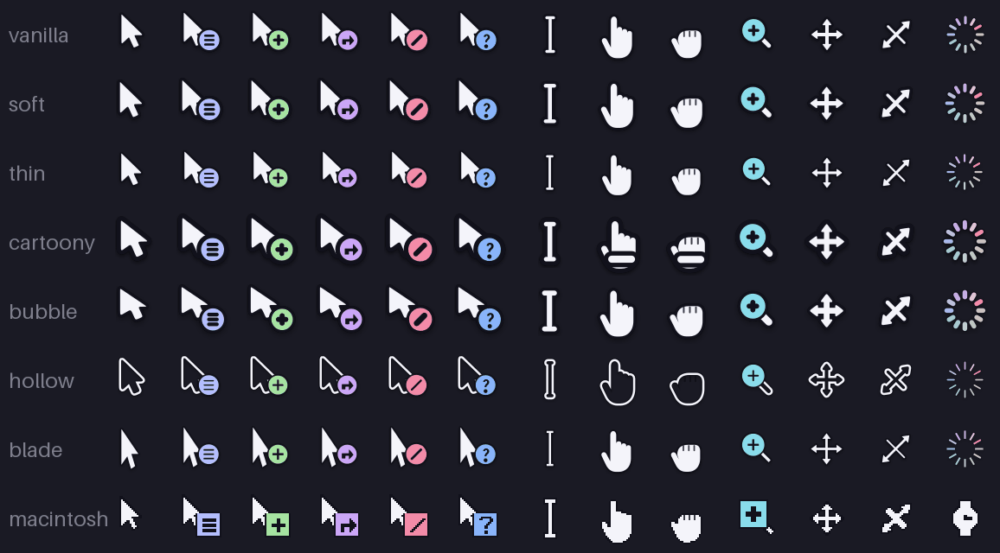
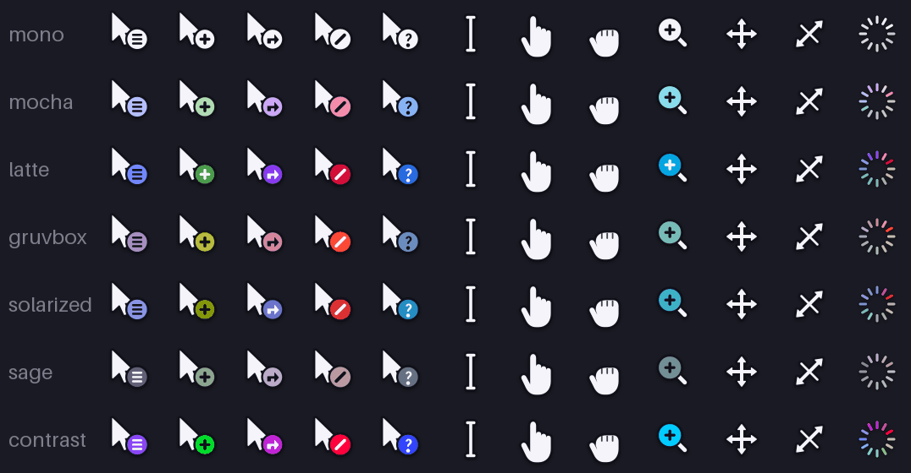

## cursors

a small library of my own mousecape cursor packs.

requires [mousecape](https://github.com/alexzielenski/Mousecape), or the newer
SwiftUI build [here](https://github.com/sdmj76/Mousecape-swiftUI).

### styles

| style | |
|---|---|
| `vanilla` | baseline |
| `soft` | rounder, heavier outline |
| `thin` | lighter weight, smaller |
| `cartoony` | fat arrow, white gloves |
| `bubble` | short, wide, very rotund |
| `hollow` | wireframe, hollow body, solid badges |
| `blade` | long narrow arrow, hairline, sharp corners |
| `macintosh` | 1-bit, classic, wristwatch for wait |

### palettes

| palette | |
|---|---|
| `mono` | no accent, body color only |
| `mocha` `latte` | full-saturation, cool |
| `gruvbox` | warm, low chroma |
| `solarized` | the usual eight, spaced out to eleven |
| `sage` | muted, separated by value more than hue |
| `contrast` | vivid accents on a pure black or white body |

### selection

`capes/{style}/{style}-{palette}-{mode}-{version}.cape`

`previews/{style}/{style}-{palette}-{mode}-{version}.png`

`light` is a light cursor, `dark` is a dark one. pick the opposite of your
desktop. the sheets above are the `light` capes.

#

feedback, reports in [issues](https://github.com/KingJayan/mousecape-cursors/issues/new).

feel free to download, test, port, and redistribute (MIT).
